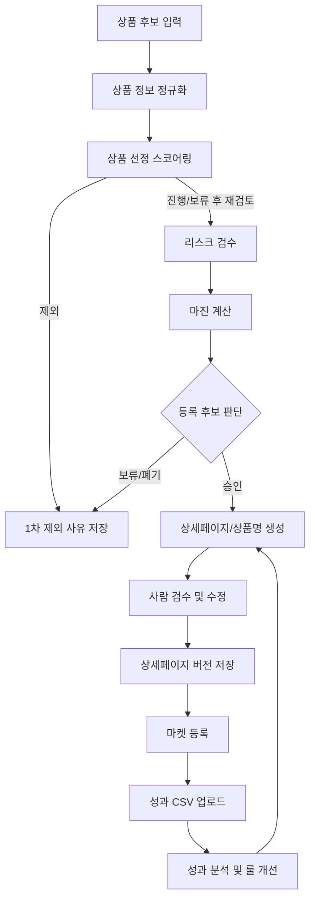

# 해외제품 구매대행 내부 운영 데이터 파이프라인 설계서

## 0. 문서 목적

본 문서는 해외제품 구매대행을 직접 부업으로 운영하면서, 향후 **AI 기반 상세페이지 자동 생성 서비스**를 만들기 위한 내부 시스템 설계 준비 문서다.

이 시스템은 구매대행을 완전 자동화하는 도구가 아니다. 핵심 목적은 직접 운영 과정에서 다음 데이터를 낮은 마찰로 축적하는 것이다.

- 상품 후보 데이터
- 리스크/마진 판단 데이터
- AI 상세페이지 초안
- 사람의 수정본과 수정 사유
- 등록 여부와 제외 사유
- 판매 성과 데이터
- 고객 문의/취소/반품 데이터

최종 목표는 다음과 같다.

> 직접 구매대행을 운영하면서 상세페이지 생성 AI를 훈련·검증할 수 있는 실전 데이터 생산 시스템을 구축한다.

---

## 1. 핵심 설계 관점

기존 관점이 “구매대행 업무 자동화”였다면, 본 문서의 관점은 다음이다.

```text
상품 후보 수집
→ 상품 선정 스코어링
→ 리스크/마진 검수
→ 상세페이지 AI 초안 생성
→ 사람 검수/수정
→ 마켓 등록
→ 판매 성과/CS 수집
→ 프롬프트·템플릿·룰 개선
```

따라서 핵심 KPI는 단순 등록 상품 수가 아니다.

중요한 KPI는 다음이다.

- AI가 생성한 상세페이지 초안의 수정률
- 사람이 자주 수정하는 항목
- 등록 제외 사유의 분포
- 상품명/상세페이지 버전별 조회수·클릭수·주문수
- 상세페이지 정보 부족으로 발생한 CS 유형
- 전환율이 좋은 상세페이지 구조

---

## 2. 시스템 설계 원칙

### 2.1 수동 입력 최소화

운영자가 직접 타이핑해야 하는 순간이 많아지면 시스템은 지속되지 않는다.

원칙은 다음과 같다.

```text
Manual typing is the enemy.
```

초기부터 모든 정보를 자동 수집할 필요는 없지만, 사용자가 반복해서 복사/붙여넣기하거나 사유를 장문으로 입력하는 구조는 피한다.

### 2.2 검수 행위 자체를 데이터화

사람의 검수는 단순 승인 절차가 아니라 향후 AI 개선을 위한 학습 데이터다.

따라서 모든 검수 결과는 구조화해서 저장한다.

- 승인
- 보류
- 폐기
- 수정
- 재생성 요청
- 최종 등록

각 판단에는 가능하면 선택형 사유 코드를 붙인다.

### 2.3 자유 텍스트보다 체크박스/태그 우선

등록 제외 사유나 수정 사유를 매번 글로 쓰게 하면 운영 피로도가 커진다.

따라서 기본 입력은 체크박스/태그 기반으로 한다.

예시:

```text
[ ] 지재권/브랜드 우려
[ ] 인증/수입요건 우려
[ ] 배송비/부피무게 위험
[ ] 역마진 위험
[ ] 옵션 복잡
[ ] 상세페이지 품질 낮음
[ ] CS 위험 높음
[ ] 경쟁 과다
[ ] 수요 불확실
[ ] 기타
```

자유 입력 메모는 선택 사항으로 둔다.

### 2.4 성과 데이터는 수동 입력보다 CSV Import 우선

마켓 API 연동은 후순위다. 초기에는 스마트스토어/쿠팡 등에서 내려받은 엑셀·CSV 파일을 업로드해 내부 데이터와 매핑하는 방식을 우선한다.

수동 입력은 최소화한다.

### 2.5 상품 단위가 아니라 버전/실험 단위로 저장

같은 상품이라도 상세페이지 초안, 수정본, 상품명 변경본, 고지문 보강본 등 여러 버전이 생긴다.

따라서 성과 데이터는 단순히 `product_id`에만 붙이지 않고, 가능하면 `listing_version_id`에 연결한다.

---

## 3. 우선 구축할 워크플로우



---

## 4. 핵심 모듈 구성

## 4.1 Product Intake Module

### 역할

상품 후보를 시스템에 빠르게 넣는 모듈이다.

### 초기 입력 방식

우선순위는 다음과 같다.

```text
P0: URL / 텍스트 / 이미지 / 스크린샷 기반 반자동 입력
P1: 후보 상품 CSV 또는 구글시트 Import
P1.5: 북마클릿 또는 간단한 Web Clipper
P2: Chrome Extension
```

Chrome Extension은 장기적으로 유용하지만, 초기 P0 구현물로 고정하지 않는다. 초기 목표는 “원클릭에 가까운 저마찰 Intake”다.

### 저장 데이터

- 원본 URL
- 소싱 플랫폼
- 원본 상품명
- 번역 상품명
- 원가
- 옵션
- 이미지
- 예상 무게/부피
- 소싱 메모
- 수집 일시

---

## 4.2 Product Selection Module

### 역할

상품 후보를 실제 리스크/마진 검수로 넘길지 빠르게 판단하고, 그 판단 근거를 구조화된 데이터로 남기는 모듈이다.

이 단계의 목적은 잘 팔릴 상품을 완벽히 예측하는 것이 아니라, 나중에 성과 데이터와 비교할 수 있는 초기 판단 근거를 축적하는 것이다.

### 선정 상태

- 진행
- 보류
- 제외

### 스코어링 항목

- 수요 판단: 높음, 보통, 낮음, 불확실
- 경쟁 강도: 낮음, 보통, 높음
- 가격 매력도: 좋음, 애매함, 낮음
- 소싱 난이도: 쉬움, 보통, 어려움
- 선택 메모

### 1차 제외 사유 코드

```text
[ ] 수요 불확실
[ ] 경쟁 과다
[ ] 가격 경쟁력 부족
[ ] 원가/배송비 불리
[ ] 옵션 복잡
[ ] 이미지/상세정보 부족
[ ] 브랜드/IP 우려
[ ] 인증/통관 우려
[ ] CS 위험 높음
[ ] 기타
```

`제외` 상품은 삭제하지 않는다. 제외 사유 분포는 이후 소싱 기준과 AI 추천 기준을 개선하는 데이터가 된다.

---

## 4.3 Risk Screening Module

### 역할

등록 전 위험 상품을 걸러내고, 상세페이지에 필요한 고지사항을 도출한다.

### 주요 리스크

| 리스크 | 예시 |
|---|---|
| 인증/수입요건 | 식품, 화장품, 의료기기, 전기용품, 영유아, 식기류 |
| IP/상표권 | 브랜드명, 캐릭터, 로고, 유명인 이미지 |
| 통관 | 배터리, 액체, 자석, 칼날, 전파기기 |
| 배송 | 고중량, 대형, 유리, 파손 가능 상품 |
| CS | 사이즈 민감, 색상 편차, 조립 난이도 |
| 마켓 정책 | 금지어, 과장 표현, 의약적 효능 표현 |

### 출력

- 리스크 점수
- 등록 추천/보류/비추천
- 필수 고지사항
- 사람 검수 필요 항목
- 제외 또는 보류 사유 코드

---

## 4.4 Margin Calculation Module

### 역할

구매대행 특화 보수적 마진을 계산한다.

### 반영 항목

- 해외 원가
- 해외 내륙 배송비
- 환율
- 환율 버퍼
- 해외결제 수수료
- 배대지 배송비
- 부피무게 리스크
- 국내 배송비
- 마켓 수수료
- 광고비 가정
- 반품/CS 리스크 버퍼

### 출력

- 추천 판매가
- 예상 순이익
- 순마진율
- 손익분기 판매가
- 배송비 상승 시 민감도
- 등록 가능 여부

---

## 4.5 Listing Generation Module

### 역할

등록 가능한 상품에 대해 AI가 상세페이지 초안을 생성한다.

### 생성물

- 상품명
- SEO 키워드
- 옵션 설명
- 상세페이지 본문
- 구매대행 고지문
- 배송 안내문
- 교환/반품 안내문
- 관부가세 안내문
- 고객 FAQ

### 중요 저장 항목

- AI 초안
- 프롬프트 버전
- 템플릿 버전
- 사용한 상품 정보
- 생성 시점

---

## 4.6 Human Review Module

### 역할

사람이 AI 초안을 빠르게 검수하고 수정하며, 그 행위를 데이터로 저장한다.

### 필수 기능

- 승인 / 보류 / 폐기 버튼
- 수정 전후 비교
- 수정 사유 체크박스
- 위험 판단 재정의
- 최종 등록본 저장

### 수정 사유 예시

```text
[ ] 번역 어색함
[ ] 상품명 SEO 약함
[ ] 과장/금지 표현 우려
[ ] 구매대행 고지 부족
[ ] 옵션 설명 부족
[ ] 배송 안내 부족
[ ] 고객 불안 해소 부족
[ ] 문체가 너무 AI 같음
[ ] 이미지와 설명 불일치
[ ] 기타
```

---

## 4.7 Performance Import Module

### 역할

마켓 성과 데이터를 수집해 상세페이지 버전과 연결한다.

### 초기 방식

- 스마트스토어/쿠팡 등에서 엑셀·CSV 다운로드
- 시스템에 업로드
- 상품명, 판매자 상품코드, 내부 상품 ID 기준으로 매핑
- 가능하면 `listing_version_id`와 연결

### 수집 데이터

- 노출수
- 클릭수
- 찜/장바구니
- 주문수
- 매출
- 취소
- 반품
- 문의수
- 문의 유형

---

## 5. 최소 데이터 구조

초기에는 과도한 DB 설계보다 아래 개념만 유지한다.

```text
products
- 상품 후보 기본 정보

selection_reviews
- 상품 선정 점수와 진행/보류/제외 판단

risk_reviews
- 리스크 점수와 등록 판단

margin_reviews
- 마진 계산 결과

listing_versions
- AI 초안, 사람 수정본, 최종 등록본

review_actions
- 승인/보류/폐기/수정 이력과 사유 코드

performance_logs
- 조회수, 클릭수, 주문수, 문의수 등 성과 데이터

cs_logs
- 문의, 취소, 반품 사유
```

가장 중요한 테이블은 `listing_versions`다. 상세페이지 자동 생성 AI의 개선은 결국 버전별 생성물과 성과 비교에서 나온다.

---

## 6. MVP 우선순위

## P0: 내부 운영 가능한 최소 버전

- 상품 URL/텍스트/이미지 기반 후보 등록
- 상품 선정 스코어링
- 리스크 체크리스트
- 보수적 마진 계산기
- 상세페이지 초안 생성
- 승인/보류/폐기 버튼
- 사유 코드 체크박스
- AI 초안과 사람 수정본 저장

## P1: 데이터 파이프라인 강화

- 후보 상품 CSV/시트 Import
- 성과 CSV Import
- 상품별/버전별 성과 매핑
- 수정 사유 통계
- 등록 제외 사유 통계

## P2: 운영 자동화 확장

- 북마클릿 또는 Web Clipper
- 상품 이미지 자동 저장
- 상세페이지 템플릿 A/B 비교
- CS 유형 자동 분류

## P3: 고도화

- Chrome Extension
- 마켓 API 연동
- 배대지 연동
- 알림톡 자동화
- 성과 기반 프롬프트 자동 개선

---

## 7. 후순위로 둘 기능

초기에는 다음 기능을 무리하게 구현하지 않는다.

- 멀티마켓 원클릭 등록
- 배대지 자동 신청
- 개인통관고유부호 자동 검증
- 카카오 알림톡 자동 발송
- 완전 자동 소싱
- 완전 자동 지재권 판별
- 마켓 API 실시간 연동

이 기능들은 매력적이지만, 초기 목적에는 과하다. 먼저 내부 데이터 파이프라인이 실제로 굴러가는지 검증한다.

---

## 8. 최종 정리

이 시스템의 본질은 다음이다.

> 구매대행을 자동화하는 시스템이 아니라, 구매대행 운영을 하면서 상세페이지 생성 AI를 훈련시키는 실전 데이터 생산 시스템이다.

따라서 초기 설계의 핵심은 다음 네 가지다.

1. 상품 후보 입력 마찰 최소화
2. 체크박스/태그 기반 검수 데이터 축적
3. 상세페이지 버전 관리
4. 성과 CSV Import를 통한 실제 판매 결과 연결

이 네 가지가 작동하면, 이후 상세페이지 자동 생성 서비스의 핵심 자산인 “AI 초안 → 사람 수정 → 실제 판매 성과” 데이터 루프를 만들 수 있다.
